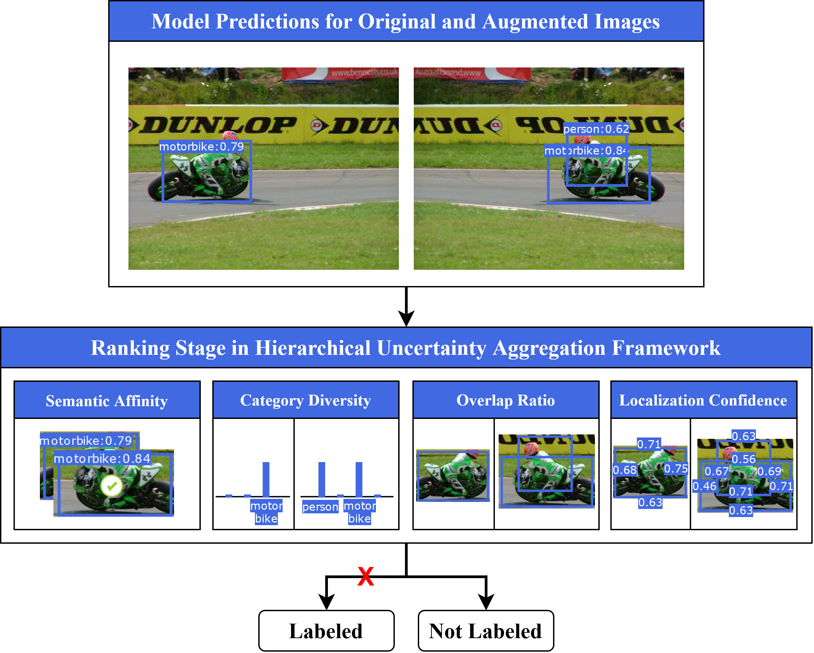
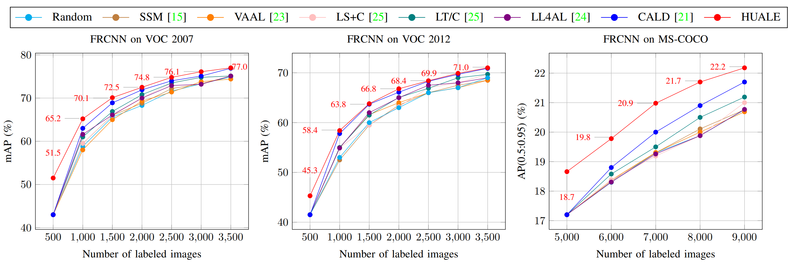

# Implementation of Hierarchical Uncertainty Aggregation and Emphasis Loss for Active Learning in Object Detection
This repository contains PyTorch implementation for the IEEE BigData 2023 special session MLBD 2023 paper: 


**[Hierarchical Uncertainty Aggregation and Emphasis Loss for Active Learning in Object Detection](https://www.researchgate.net/profile/Toan-Khoa-Nguyen/publication/377601669_Hierarchical_Uncertainty_Aggregation_and_Emphasis_Loss_for_Active_Learning_in_Object_Detection/links/65e72c94adf2362b637827e5/Hierarchical-Uncertainty-Aggregation-and-Emphasis-Loss-for-Active-Learning-in-Object-Detection.pdf)**

Object detection has achieved remarkable advancements through the utilization of deep neural networks; however, its heavy reliance on extensive labeled data remains a significant challenge. We first delve into active learning strategies that leverage the power of uncertainty estimation and detector resilience. Departing from approaches biased toward high-performing classes, we present an innovative solution known as Hierarchical Uncertainty Aggregation and Emphasis Loss (HUALE). This approach introduces hierarchical uncertainty aggregation, which effectively retrieves and ranks unlabeled images for precise image selection. Secondly, we introduce the Emphasis loss, a novel loss augmentation to object detection training, and combine it with the EIoU loss and Synchronic IoU-Localization loss to elevate the accuracy of bounding box localization and address non-convexity challenges. Our method, built upon the Faster R-CNN framework, consistently outperforms the baseline (random selection) with average mAP (%) improvements of 4.53/3.44/1.57 across the PASCAL VOC 2007, PASCAL VOC 2012, and MS COCO datasets.

## Table of Contents

- [Update](#update)
- [Introduction](#introduction)
- [Installation](#installation)
- [Data](#data)
- [Usage](#usage)

## Update
- **June 2024**: We release 1st version of codebase.

## Introduction
This repository provides implementations on a collection of 3 benchmark datasets: PASCAL VOC07, PASCAL VOC12, and MS-COCO. Our implementations are built on state-of-the-art deep learning frameworks and are designed to be easily extensible and customizable.

The repository is structured as follows:

- **data/**: This directory contains scripts and utilities for downloading and preprocessing benchmark datasets.
- **output/**: This directory contains processes' outcome including logs and checkpoints.
- **scripts/**: This directory is intended to store experimental scripts.
- **src/**: This directory contains the source code for training, evaluating, and visualizing GNN models.
- **README.md**: This file contains information about the project, including installation instructions, usage examples, and a description of the repository structure.
- **environment.yml**: This file lists all Python dependencies required to run the project.
- **.gitignore**: This file specifies which files and directories should be ignored by Git version control.

## Installation

To re-produce this project, you will need to have the following dependencies installed:
- Ubuntu 18.04.6 LTS
- CUDA Version: 11.7
- [Miniconda](https://docs.conda.io/en/latest/miniconda.html)
- Python 3
- [PyTorch](https://pytorch.org/) (version 2.0 or later)

After installing Miniconda, you can create a new environment and install the required packages using the following commands:

```bash
conda create -n huale python=3.9
conda activate huale
pip install torch==2.0.0 torchvision==0.15.1 torchaudio==2.0.1
conda env update -n huale --file environment.yaml
```

## Data
To refer benchmark datasets, please get access this link and download here.
After finishing the download process, please put them into the directory **/data**.

<!--  -->

## Usage
All relevant data is stored within the **/data** directory. To configure the settings for each dataset, corresponding configuration files are provided in the **/src/config** folder.

To reproduce experiments, please refer:
```bash
## scripts/train.sh

```



## Citation
Please cite this paper if it helps your research:
```bibtex
@inproceedings{nguyen2023hierarchical,
  title={Hierarchical Uncertainty Aggregation and Emphasis Loss for Active Learning in Object Detection},
  author={Nguyen, Tai and Nguyen, Khoa and Nguyen, Thanh and Nguyen, Tri and Nguyen, Anh and Kim, Karrman},
  booktitle={2023 IEEE International Conference on Big Data (BigData)},
  pages={5311--5320},
  year={2023},
  organization={IEEE}
}
```
